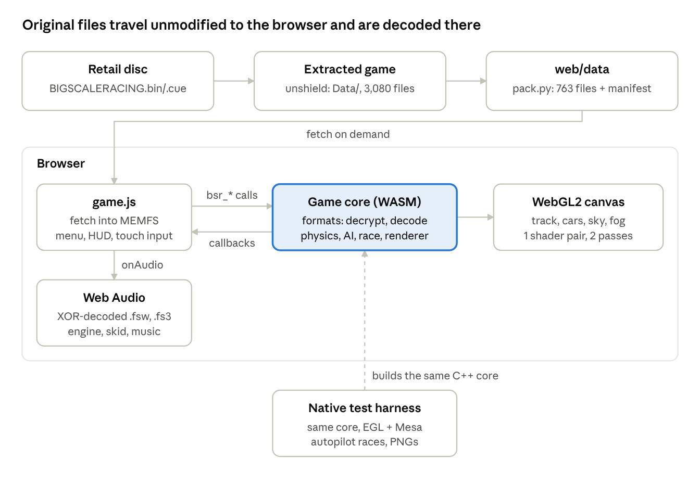

# Big Scale Racing WebAssembly Port — Technical Documentation

Oct 7, 2026 · Dylan Fantauzzo

## Overview

The project runs *Big Scale Racing* (BumbleBeast, 2002, Windows/Direct3D 7) in a web browser by pairing a new C++ engine, compiled to WebAssembly, with the game's original, unmodified data files. Nothing from the original executable runs: the engine decodes the game's own encrypted and packed formats at load time, so the retail files are served as-is.

| Area | Reproduced | Not reproduced |
| --- | --- | --- |
| Content | 6 tracks, 11 car classes, 12 skins per class, 6 weather presets | Career mode, original menus, prize ceremonies |
| Gameplay | Grid starts, checkpoints, laps, positions, results, AI opponents on the original racing lines, two-player split-screen | Pit stops, false starts, replays |
| Multiplayer (new) | Online races for up to 8 players through a WebSocket relay, with AI cars run by the host | — |
| Simulation | New raycast-suspension car model tuned to the original top speeds | The original `bamms.dll` multibody physics |
| Presentation | Textures, lightmaps, env maps, sky domes, fog, engine/skid/impact sounds, MP3 music | Rain particles, smoke, TV cameras |
| Input | Keyboard, gamepad, touch | Force feedback |

The code lives in `bsr-web/`: `src/` (engine), `web/` (page, loader, HUD, audio), `tools/` (data packer, format library, tests). `README.md` covers building; `FORMATS.md` is the short format reference this document expands on.

## Reverse-engineering process

The formats were recovered by combining statistical analysis of the data with a Ghidra decompilation of `Big Scale Racing.exe`; every finding was then confirmed by decoding all files of that type without error.

1. **Disc image.** `BIGSCALERACING.bin/.cue` is one MODE1/2352 data track; the two `.iso` files are identical 2048-byte-sector extractions of it. `bsdtar` lists 25 files: an InstallShield 5 installer, DirectX 8.1 redistributables and `data1.cab` (564 MB).
2. **Installer.** `data1.cab` (magic `ISc(`, version `0x01000004`) was unpacked with `unshield`, built from source. Result: 3,080 files, 614 MB, under `Program_Executable_Files_Group/` — the exe, `bamms.dll` (vehicle physics), `djoy.dll`, `mpglib.dll`, `unzip32.dll` and `Data/`.
3. **Triage.** Magic strings identified the plain container formats (`FSO_Database`, `FST_Terrain`, `FSO_Mattable`). Music, audio samples, texture payloads and most `.bin` files had near-uniform byte statistics — encrypted or compressed.
4. **The key.** A byte run shared by unrelated encrypted files at different offsets suggested a fixed keystream. Taking the most frequent byte per position mod 16 across 106 encrypted files (plaintext zeros dominate) yielded a 16-byte repeating XOR key. The decrypted music began `FF FB 90` with a `LAME3.92` tag.
5. **Confirmation in code.** The key bytes occur once in the exe, at file offset `0xB52D8` (VA `0x4B52D8`). Its only reader, `FUN_00457780`, XORs a buffer whose key index restarts at 0 for every call — which explained why `Materials.bin` looked like it used a shifted key (it is read in two chunks).
6. **Containers.** The FSO loader (`FUN_004771f0` and the node readers at `0x477920`–`0x478160`) and the FST loader (`FUN_00466360`) were read from the decompiled C to derive the layouts in the next section.
7. **Textures.** After decryption, a 16×16 black texture packed to `FF 3A 3A 3A FF 3A 3A 3A`: two TGA-style RLE packets of 128 pixels. Testing per-format pixel sizes decoded all 2,202 `.fsp` files exactly to width × height.
8. **Orientation.** Two conventions were settled empirically: rows are stored bottom-up, and UVs are 3ds Max style. The proof was fitting the AI racing line to the game's own minimap image under all 8 rotations/mirrorings — an unmirrored fit scored 0.88 (Mach) and 0.93 (Real 80) versus at most 0.70 for any mirrored one.

Tools used: `bsdtar`, `unshield`, Ghidra headless with a decompile-all script, `radare2` for imports and sections, and Python for statistics and prototype parsers (`tools/bsrfmt.py`).

## Data formats

All game data uses five container formats plus raw WAV/MP3, and one 16-byte XOR key protects most of it. Integers are little-endian; world space is right-handed, Z up, in metres (cars are about 0.4 × 0.7 m, 1:5 RC scale).

### Encryption

Each `fread()` buffer is XORed with this key, index restarting at 0 per read call:

```
47 c3 f5 12 38 e9 b5 91 25 63 06 d9 aa 6f 3a 73
```

| File type | What is encrypted |
| --- | --- |
| `.fs3` music | Whole file (decrypts to MP3, LAME 3.92) |
| `.fsw` sound | Only the `data` chunk; RIFF header is plain |
| `.fsp` texture | RLE payload; header and palette plain |
| `weather.bin`, track `.bin`, `Languages/*.bin` | Whole file |
| `class_*.bin`, `Materials.bin` | Whole file, read in several chunks (key restarts per chunk) |
| `.fso`, `.fst`, `.fsm`, `bamms_*.bin`, `Maps_cars/*.tga` | Not encrypted (`.fso` magic may be) |

### `.fsp` textures

```
u32 width, height, format, mipCount, dataSize
[format 1: u8 palette[256][4] BGRA, plaintext]
u8  data[dataSize]   // XOR, then TGA-style RLE; rows bottom-up
```

RLE packet header `c`: `n = (c & 0x7F) + 1`; if `c & 0x80` the next pixel repeats `n` times, else `n` literal pixels follow.

| Format | Pixel | Bytes | Files | Typical use |
| --- | --- | --- | --- | --- |
| 7 | BGR888 | 3 | 624 | `Maps_high` opaque |
| 2 | RGB565 | 2 | 625 | `Maps_low` opaque |
| 11 | BGRA8888 | 4 | 439 | `Maps_high` with alpha |
| 5 | ARGB4444 | 2 | 439 | `Maps_low` with alpha |
| 1 | 8-bit palette index | 1 | 74 | Shadow and spray maps |
| 4 | ARGB1555 | 2 | 1 | Rare |

### `.fso` scene database

Magic `FSO_Database\0` (13 bytes), then four sections whose sizes are the file's last 16 bytes: **nodes**, **geosets**, **mattables**, **materials**.

**Nodes** form a tree, root first. Every node has a 0x3C-byte header: `u32 type`, a name from byte 9, and a bounding sphere at 0x2C.

| Type | Meaning | Payload after header |
| --- | --- | --- |
| 1 | Group, one child | `u8 hasChild` |
| 2 | Transform | `u8 flag, u8 hasChild, pad, float m[16]` (D3D row-major) |
| 3 | List | `u32 count`, then children |
| 4 | Light | `u8 hasChild, pad, float[16]` — direction [1..3], diffuse [4..7], ambient [8..11] |
| 5 | Switch / LOD | `u32 count, float ranges[16]`, then children |
| 6 | Mesh instance | `i32 ?, i32 geoset, i32 mattable` |
| 8, 9, 10 | Unused by tracks and cars | Sizes known, skipped |

**Geosets** are LOD chains: `u16 meshCount` at +4, centre at +8, `float lodDist[16]` at +0x1C, meshes from +0x5C (mesh 0 = most detailed). Each mesh has a 15-word header (`[2]` vertices, `[4]` normals?, `[5]` colours?, `[6]`/`[7]` UV0/UV1?, `[8]` triangles, `[11]` extras), then the arrays in that order, `u16` indices (CCW front faces), and 8 bytes per face whose first `u16` is the material slot.

**Mattables** list material names per mesh instance; **materials** are a 0xB4-byte struct (ambient at 0x08, diffuse at 0x18, texture count at 0x50) followed by the name and texture paths with flags. A second texture named `XT_shadow*` is a lightmap on UV1; `FX_environment*` is a reflection map.

### `_meta.fso` track metadata

An FSO whose meshes are 3ds Max splines stored as `[knot, inHandle, outHandle]` vertex triples, evaluated as cubic Beziers.

| Name pattern | Meaning |
| --- | --- |
| `m_meta_gridpos01..24` | Start slot: 2-knot line giving position and heading |
| `m_meta_checkpointNN` | Gate across the track; `01` is start/finish; suffix `P` = pit lane only |
| `m_meta_aii01..06` | Closed AI racing lines; `06` is an alternate line |
| `m_meta_aisl01`, `aisr01` | Left and right track edges |
| `pitpos`, `podiumpos`, `prizepos` | Pit and ceremony positions (unused) |

### `.fst` collision

Magic `FST_Terrain\0`, `u32 vertexCount, triCount`, `float[3]` vertices, then 0x3C-byte triangles: `float f0; u32 v[3]; u32 surface; float normal[3], d; float bmin[3], bmax[3]`, followed by a quadtree the port does not use (it builds its own grid).

### `weather.bin`

47 records of 2,424 bytes: name (64), fog flag at 64, fog colour at 68, fog start/end at 84, light colour at 140, then 8 texture swaps (`from` at 164 + 64·i, `to` at 676 + 64·i). The swaps replace the sky-dome placeholder `do_domereplace` with a real sky such as `do_T_512`.

### Other files

| File | Contents | Used |
| --- | --- | --- |
| `hud.ini` | Speedometer range per class (37–81 km/h) | Yes, as top speed |
| `Music.ini` | Music per game state | Informs the music choice |
| `Maps_cars/*.tga` | Car skins, uncompressed 32-bit TGA | Yes |
| `Cars/mats_<class>_NN.fsm` | Skin variants (unaligned mattable + materials) | Body texture name only |
| `Cars/class_*.bin` | Per-class sound, HUD and effect asset names | No |
| `Cars/<track>/bamms_*.bin` | Multibody physics models for `bamms.dll` | No |

## Architecture

Original files travel unmodified from disk to the browser and are decoded only inside the WASM engine, which is split into a platform-independent core and two thin front-ends: the browser build and a native test harness.



Only `pack.py` touches the files before the browser, and it only copies them; decryption and decoding happen in the WASM core (graphics, physics, race data) and in `game.js` (audio).

| Module | Files | Responsibility |
| --- | --- | --- |
| Formats | `src/formats.h/.cpp` | XOR decryption, `.fsp`/`.tga` decoding, `.fso`/`.fst` parsing, weather presets; reads from a configurable data root (`/data/` in the browser) |
| Renderer | `src/render.h/.cpp` | Builds GPU meshes from FSO nodes, texture cache, GLES3/WebGL2 shaders and draw passes |
| Physics | `src/physics.h/.cpp` | Collision grid over the `.fst` mesh, raycast-suspension car, chassis spheres, car-to-car contact |
| Race | `src/race.h/.cpp` | Meta splines (grid, checkpoints, AI lines), AI driver, gate crossing |
| Game | `src/game.h/.cpp` | Race lifecycle, standings, per-player cameras and viewports, draw order; callbacks for audio and events |
| Net sync | `src/netsync.h/.cpp` | Packs a car's state into a snapshot; buffers and interpolates the snapshots of remote cars |
| Browser glue | `src/main.cpp` | WebGL2 context, keyboard/gamepad/touch, canvas sizing, exported `bsr_*` API |
| Front-end | `web/index.html`, `game.js`, `style.css` | Menu, data loader, HUD, Web Audio, touch controls, online lobby and state relay |
| Dev server | `tools/devserver.py` | Static files, the multiplayer WebSocket relay (`/ws`), smoke-test endpoints |
| Harness | `tools/harness/harness.cpp` | Same core on Linux with EGL surfaceless + Mesa; autopilot races and screenshots |

`Game` has no Emscripten dependency: everything platform-specific reaches it through `Input`, `Callbacks` and `render(w, h)`. That is what lets one codebase be validated natively and shipped to the web.

The compiled engine is 144 KB of WASM plus 96 KB of Emscripten JS. The packed data is about 140 MB across 763 files, fetched on demand into MEMFS: a single race needs 9–18 MB of track files plus the shared cars and sounds.

## Rendering

The renderer is a single WebGL2 (GLES 3.0) shader pair that reproduces the original's fixed-function look: baked lighting on tracks, simple sun lighting on cars, lightmaps, sphere-mapped reflections, alpha test and linear fog.

### Model building

`Renderer::buildModel` walks the FSO node tree, multiplying type-2 transforms, and turns every mesh instance into a `Part`:

- Only LOD 0 of each geoset is uploaded; at 1:5 scale the detailed meshes are cheap.
- Triangles are sorted by material slot into `Batch`es sharing one VAO and index buffer.
- Interleaved vertex: position, normal, UV0, UV1 (falls back to UV0), BGRA colour — 44 bytes.
- `g_reflection` subtrees (mirrored wet-weather copies) and `sunflare` nodes are skipped; parts named `dome` ignore fog.
- A texture-override map swaps names at build time: the weather's sky (`do_domereplace` → `do_T_512`) and car skins (`rctruck01` → `rctruck07`).

### Materials and passes

| Material property | Source | Shader effect |
| --- | --- | --- |
| Unlit | All track materials (lighting is baked) | Colour × weather light tint |
| Lit | Car materials | Ambient + diffuse × max(N·L, 0) from the track's type-4 sun light |
| Lightmap | Second texture not named `environment` | × texture(UV1) |
| Environment map | Second texture named `FX_environment*` | + 0.25 × sphere-mapped reflection; cars add a specular highlight |
| Vertex colour | Mesh has colours | × vertex colour |
| Alpha test | Texture has any alpha < 255 | Discard below 0.5, drawn two-sided |
| Blend | Name contains `schaduw`, `shadow` or `fx_` | Second pass, depth write off, polygon offset |

Draw order per frame: track opaque, cars opaque (body plus four wheel matrices), track blended, car shadows blended. Fog is linear between the weather's start and end distances, mixed at most 85%.

### Coordinate conventions

- World space is used as-is: right-handed, Z up, CCW front faces — GL defaults, so no axis swap or winding flip.
- Texture rows are uploaded bottom-up exactly as stored, and UVs are used unchanged. An early `1 − v` flip turned all text upside down and was removed once the minimap fit settled the convention.
- FSO matrices are D3D row-major, the same memory layout as GL column-major, so they upload directly.

## Physics, AI and race logic

The original `bamms.dll` multibody solver is replaced by a fixed-step (240 Hz) rigid-body car on four raycast wheels; with it, all 8 cars finish 3-lap races on all 6 tracks, with AI lap times of 14–31 s depending on the track.

### Collision world

`CollisionWorld` loads the `.fst` triangles, drops degenerate ones, recomputes normals from the winding and buckets them in a 2 m × 2 m XY grid. Queries de-duplicate with a per-query stamp. It offers three operations:

- `raycast` — one-sided Möller–Trumbore against front faces (wheel rays, camera ground clamp, spawn height).
- `sphere` — closest-point-on-triangle contacts; spheres more than one radius behind a face are ignored so thin barriers do not push cars through.
- `groundHeight` — a downward raycast.

### Car model

| Aspect | Implementation | Key values |
| --- | --- | --- |
| Body | Rigid body, diagonal inertia from a 0.4 × 0.7 × 0.2 m box (× 1.6) | 8 kg; Monster 12 kg |
| Wheel geometry | Hub centres and radius from the `m_whl_*` part bounding boxes | CoM 2 cm above the wheel centroid |
| Suspension | Spring-damper per wheel along the body up axis, bump stop at full travel | 3.2 Hz, damping ratio 0.55, ±3 cm travel |
| Lateral grip | Force that cancels 60% of the contact patch's side velocity per step, limited by μN | μ 1.2 std, 1.35 hop-up, 1.1 Monster |
| Drive | Force falling linearly to zero at top speed; all-wheel drive | accel = 5 + 0.35 × top speed (m/s²) |
| Top speed | From `hud.ini` | 37–81 km/h; Monster 50 |
| Braking and reverse | Brake while slower than 0.6 m/s engages reverse (top 5 m/s) | 9 m/s² brake |
| Friction circle | Combined lateral + longitudinal force clamped to μN | — |
| Steering | Up to 0.5 rad, reduced with speed to 45% at high speed | — |
| Chassis contacts | The model's `m_coll_sphere_NN` spheres against the world; impulse with inertia | Restitution 0.25, friction 0.3 |
| Car to car | Two spheres per car along its axis, equal-and-opposite impulses | Restitution 0.3 |
| Grid hold | `hold` flag locks the wheels during the countdown | — |

The car reports `rpm`, `skid` and `impact` each step for the audio layer.

### AI driver

`driveAI` follows one of the first five `aii` lines (the sixth is an alternate line that misses a checkpoint on Baanbreker):

1. Find the nearest line point within ±40 samples of the last one.
2. Steer toward a point `0.7 + 0.28 × speed` metres ahead (gain 1.6, clamped).
3. Limit speed: for every point within braking distance, curvature k gives a corner speed √(0.8 μ g / k); the target is the lowest of √(v² + 2 × 5 m/s² × distance). Skill (0.86–0.96 per car) scales top and corner speed.
4. Throttle or brake proportionally to the speed error.
5. Recover: below 0.4 m/s with throttle for 1 s → reverse with opposite lock for 1 s; three such episodes within 8 s → respawn on the line.

### Race flow

- **States:** Countdown (4 s, cars held; online it is held until every player has loaded) → Racing → Finished (every local player done; the rest keep driving and finished players switch to autopilot).
- **Roles:** each car on the grid is a local player (0 or 1), an AI car simulated here, or a remote car. `Game::start` takes them as a string, one character per car (`"01aaa"` = split-screen with three AI cars; `"r0ra"` = online, the second car is ours and the fourth is an AI car we host).
- **Laps:** each racer must cross its next checkpoint gate in order (2D segment intersection between frames); crossing gate 01 starts a lap, and passing it after the last lap finishes the race.
- **Standings:** finishers by finish time, then laps × 1000 + checkpoints × 10 − distance to the next gate.
- **Resets:** upside down for 1.5 s (player) or 1 s (AI), or falling below the track → respawn on the racing line; the player can press R.

### Split-screen

With two local players `Game::render` draws the scene twice, into the top and bottom halves of the canvas. Each player has a camera, HUD and engine/skid sound loop. The horizontal field of view is capped so the wide half-height views don't fisheye. Player 1 drives with WASD, Space, C and R; player 2 with the arrows, Right Shift, `.` and Backspace. With one gamepad connected, it goes to player 2; with two or more, they go to the players in order.

### Online multiplayer

Each browser simulates only its own car; the host also simulates the AI cars. There is no authoritative server: `tools/devserver.py` only manages rooms and forwards messages.

1. **Lobby.** A player creates a room and gets a 4-letter code (or an invite link `?room=CODE`). Up to 8 can join. The host's track, class, weather, AI count and laps are mirrored to everyone; each player picks their own skin.
2. **Start.** The host sends the grid (players in join order at the back, AI cars in front) and a race id. Every client loads the track, calls `bsr_start` with its own role string and holds the countdown (`bsr_set_waiting`) until the host sends `go`, once everyone reports ready or after 45 s.
3. **Racing.** Every 50 ms each client sends the cars it simulates as one binary packet: `float32 [raceId, count, (racer, 31 floats)…]` with position, orientation quaternion, velocities, wheel steer/compression/spin and lap progress. Receivers keep a buffer per car and draw it 100 ms in the past, interpolated between snapshots (`SnapshotBuffer`). Lap and finish state come from the owner, who sees every checkpoint crossing.
4. **Contact.** Car-to-car collisions run on both machines, but each side only moves its own car (`collideCars(a, b, moveA, moveB)`), so two players bumping each other both feel it without fighting over the other car.
5. **Leaving.** A player who leaves or disconnects is removed from everyone's race; if the host leaves, the AI cars go too and the longest-standing player becomes host. Online races can't be paused.

The relay forwards states between players, so latency is two hops through the server. The interpolation delay hides jitter and short losses (tested natively: at 9.4 m/s with 15 ms jitter and 5 % loss, remote cars stay within 3 cm of the true delayed path).

## Web front-end

`web/game.js` owns everything outside the 3D view — menu, data loading, HUD, audio and touch input — and talks to the engine through exported C functions and three callbacks.

### Startup and loading

1. `bsr.js` loads `bsr.wasm`; `onRuntimeInitialized` calls `bsr_init` (WebGL2 context, key handlers, main loop).
2. `data/manifest.json` (written by `tools/pack.py`) lists tracks, classes with skins and top speeds, weather presets, sounds and music.
3. On RACE, the loader fetches `common` + the track's files + sounds + one music track with six parallel workers, writing each into MEMFS under `/data/`. Files already loaded are skipped.
4. `bsr_start` builds the track (first time only, or on weather change) and the cars, then the countdown begins.

### Engine API (`src/main.cpp`)

| Export | Arguments | Purpose |
| --- | --- | --- |
| `bsr_init` | — | Create the context and start the main loop; returns 0 without WebGL2 |
| `bsr_start` | track, class, skins (CSV, one per car), opponents, laps, top speed (km/h), weather preset, roles | Load and begin a race; returns the number of cars, 0 on failure |
| `bsr_touch` | steer, throttle, brake | Analog input from the touch controls (player 1) |
| `bsr_set_paused` | 0/1 | Pause or resume |
| `bsr_camera`, `bsr_reset_car` | player | Camera cycle, respawn |
| `bsr_autopilot`, `bsr_stop` | 0/1 / — | AI-driven players, end race |
| `bsr_results` | — | Standings JSON: car index, local player, remote/left, place, finished, time, best lap |
| `bsr_set_online`, `bsr_set_waiting` | 0/1 | Disable pausing; hold the countdown |
| `bsr_snapshot_floats`, `bsr_get_state`, `bsr_put_state` | car, float buffer | Read the state of a car simulated here; feed a snapshot of a remote car |
| `bsr_remove_racer` | car | A remote player left: hide the car, rank it last unless finished |

| Callback (on `Module`) | Rate | Payload |
| --- | --- | --- |
| `onHud(json, player)` | 20 Hz per local player | Speed, lap/laps, place/racers, race and lap times, countdown, state, waiting |
| `onAudio(rpm, throttle, skid, impact, speed, player)` | Every frame | Drives the sound loops |
| `onEvent(name)` | On change | `beep`, `go`, `lap:<player>`, `lastlap:<player>`, `finish:<player>`, `paused`, `resumed` |

### Audio

Audio is decoded in JavaScript, not WASM. `.fsw` files are parsed as RIFF, the `data` chunk is XORed and converted to an `AudioBuffer`; `.fs3` music is XORed to MP3 and played through an `<audio>` element from a Blob URL.

| Sound | Behaviour |
| --- | --- |
| Engine loop | Serpent (std classes) or Zenoah (hop-up); playback rate 0.55 + 1.5 × rpm, gain rises with throttle |
| Tire slip loop | Gain follows `skid` above 1.5 m/s |
| Impacts | One-shot above 1.2 m/s impulse, 180 ms cooldown, two intensities |
| Crowd loop | Constant, low |
| Announcer, horn, menu clicks | On events (start, go, finish, 1st place or race over) |

### Input and frame loop

- Keyboard: arrows/WASD, Space handbrake, C camera, R reset, P or Esc pause, F2 debug lines (split-screen bindings above). Steering ramps at 3.5/s (6/s back to centre) to mimic an RC transmitter.
- Gamepad: left stick, RT/LT analog, A/X/B buttons; the pad state is sampled before counting pads (the reverse order crashes in Emscripten).
- Touch: a steering pad and gas/brake buttons, shown only on touch devices.
- Each frame resizes the canvas to CSS size × devicePixelRatio, runs `Game::update` (physics substeps at 240 Hz) and renders. A hidden tab pauses the race.

## Build, run and test

A build needs Emscripten and Python 3 plus the user's own game disc; correctness is checked by two automated tests because headless browsers on the build machine could not create a WebGL context.

### Pipeline

```sh
bsdtar -xf BIGSCALERACING01.iso -C iso/                  # 1. disc image -> installer files
unshield -d game x iso/data1.cab                          # 2. InstallShield cabinet -> game files
python3 tools/pack.py game/Program_Executable_Files_Group/Data web   # 3. copy needed files + manifest
./build.sh                                                # 4. em++ -O2 -> web/bsr.js + web/bsr.wasm
python3 tools/devserver.py 8000                           # 5. serve web/ at http://localhost:8000 (--host 0.0.0.0 for LAN/online)
```

`tools/pack.py` resolves every texture the selected FSOs reference (track folder, then `Maps_high`, then `Maps_cars`), collects the 12 skins per class from the `.fsm` files, the weather sky textures, sounds and music, and copies them with lowercased paths (the original ran on a case-insensitive filesystem). Files are copied byte for byte; no conversion happens at build time.

Key Emscripten flags: `-sUSE_WEBGL2 -sMIN_WEBGL_VERSION=2 -sALLOW_MEMORY_GROWTH -sINITIAL_MEMORY=128MB -sFORCE_FILESYSTEM -sEXPORTED_RUNTIME_METHODS=ccall,cwrap,FS,UTF8ToString,HEAPF32` (`HEAPF32` carries network snapshots).

### Tests

| Test | What runs | What it checks |
| --- | --- | --- |
| Native harness (`tools/harness`) | The full `Game` core on Linux, GLES3 via EGL surfaceless + Mesa llvmpipe, player on autopilot | Every car finishes on every track; lap times, positions, events; PNG screenshots for visual review |
| Node integration (`tools/nodetest.js`) | Real `bsr.js`, `bsr.wasm`, `game.js` with stub DOM, WebGL2 and Web Audio | Menu built from the manifest, files fetched into MEMFS, `bsr_start`, 2,400–3,000 frames, countdown/go/finish events, HUD JSON, sound decryption |
| Format sweep (`tools/bsrfmt.py`) | Ad-hoc sweeps with the Python parsers over all game files (not a checked-in test) | All 2,202 textures and 55 FSO files decode exactly |

```sh
tools/harness/build.sh
OPP=7 LAPS=3 tools/harness/harness web/data baanbreker pro_std /tmp/shots 150 5 20
node tools/nodetest.js mach pro_std 50
```

Harness options are environment variables: `CAM` (0–2), `OPP`, `LAPS`, `TOP` (km/h), `SKINS`, `WEATHER`, `DEBUG` (draw checkpoints and the AI line), `MANUAL` (full throttle, no autopilot), `TRACE`/`TRACE_CAR` (per-0.5 s car state). `tools/montage.py` tiles screenshots into a contact sheet.

The tests found bugs that a browser would have hit: the gamepad call order, cars reversing on the grid during the countdown, AI cars stuck behind walls, and a lap event firing after the finish.

## Known limitations and future work

The port has not yet been played in a real browser by a person, so driving feel is the largest unknown; the rest are missing features with clear starting points in the data.

| Area | Limitation | Possible next step |
| --- | --- | --- |
| Verification | No WebGL in headless Firefox on the build machine; browser rendering is inferred from the native harness and the Node test | Play-test in Chrome/Firefox/Safari; add a headless Chromium (SwiftShader) screenshot test |
| Handling | Physics constants are hand-tuned against lap completion, not against the original game | Tune from play-testing; or decode `bamms_*.bin` and the `bamms.dll` API (10 exports) |
| Weather | Wet/rain presets change sky, fog and tint only | Rain particles and sounds, `g_reflection` geometry for wet tracks, `XT_shadow*wet` lightmaps |
| Track cameras | `<track>_cams.bin` (TV cameras) is not decoded | Reverse the camera loader for a replay/TV view |
| Game modes | Single race only: no career, prizes, podium or pit stops | Podium and prize positions already exist in `_meta.fso` |
| Effects | No tire smoke, engine smoke or spray (asset names are in `class_*.bin`) | Billboard particles using the existing textures |
| LOD | Only LOD 0 is drawn | Use the geoset LOD distances on low-end devices |
| Low-detail data | `Maps_low` and `_mid`/`_low` track files are unused | Offer a low-detail option for phones (smaller downloads) |
| Memory | GPU resources of a previous track are not freed on track change | Release VAOs, buffers and textures in `Game::start` |
| Distribution | `web/data` is copyrighted game data | Keep it out of version control (already in `.gitignore`); users supply their own disc |
